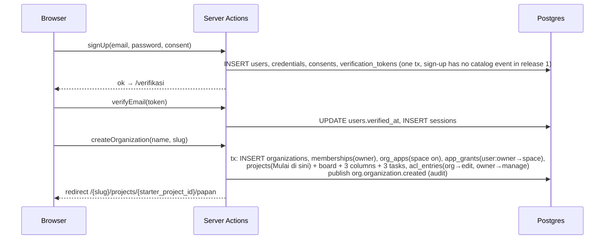
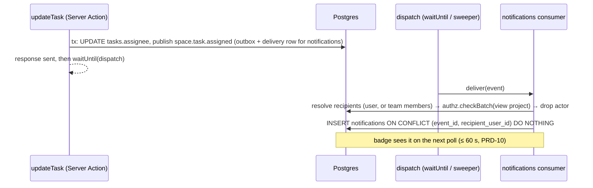

# TECH-01 — Data Flow & Integration Contract (Release 1)

| Field | Value |
|---|---|
| Version | 1.6 (supersedes 1.5) — `tasks.done_at` for completion numbers (D50) |
| Status | Draft — for BE + FE review in W0; binding from W1 (Kanban, weekly cadence) |
| Owner | BE engineer (data, APIs) + FE engineer (client data layer); PO approves scope |
| Last updated | 28 Sep 2026 |
| Audience | The 1 BE and 1 FE engineer, and the Antigravity agents generating code and tests |
| Derives from | Index (engineering context), PRD-00 (scope, capacity), PRD-00b (events), PRD-01 (sessions), PRD-02 (tenancy, URLs), PRD-03 (Work Ownership), PRD-04 (authz), PRD-06 (Project), PRD-10, PRD-11, PRD-12, PRD-13, UI-01 |
| Does not add scope | If this document and a PRD disagree about **behavior**, the PRD wins and this document is fixed. This document decides **how data moves**. |

**Purpose.** Before this document, the answers to "where does this number come from, who writes this row, and how does the screen learn it changed?" were spread across 13 PRDs. This document puts them in one place so that the two engineers can work in parallel against one contract from sprint 1.


**Changes in v1.4 (28 Sep 2026):** two languages with English default (D45: `users.locale`, `organizations.default_locale`, resolution F16, recipient-language rendering); AI Agent model (D44, PRD-17 v1.0: agent tables replace `skill_triggers`, run flow F15, AI Gateway). Release 1 impact: D45 only (PRD-00 v1.2.8 §4.2 step 9).

**Changes in v1.3 (28 Sep 2026):** prototype v17.1 decisions. Release 1: list reorder and drop-to-status (F11, PRD-06 v2.1 §6.10), onboarding *Titik mulai* seeding (F14, PRD-02 v1.2, D30), counts from top-level tasks on the current board (§4.1). Later releases, contract only: subtasks `tasks.parent_task_id` (D28a/D38), checklist items, saved views (release 2), timeline import (F12, D40), doc autosave with versions (F13, D39, release 3), skill triggers (PRD-17 v0.2, D31, release 3), requests (PRD-15, D8). Nothing here adds scope: each item ships in the release its PRD names.

**Changes in v1.2 (27 Sep 2026):** Space container (D18/C-18): table `spaces`, `projects.space_id`, container type `space.space`, uploaded space icons in Vercel Blob (§3, §4, §7, F10); Semua proyek replaces the Ringkasan loaders (D21; F7 void); list pattern loaders and `completeTasks` shared by Daftar, Tugas saya and Permintaan (D25); notifications `archived_at` and tab filters (PRD-10 v1.3, F9); `guide_progress` (PRD-18); release-3 `agent` module registered (PRD-17, inactive); File on hold (D22). FE shell: navigasi ganda (rail + contextual panel), Agere DS `Select`, `ButtonGroup`, `Tabs` underline and `ScrollArea` as shared primitives (§8).

**Changes in v1.1 (26 Sep 2026):** project space tabs and landing (PRD-06 v1.3) in §4, §7, §8; project status columns (Should); QA v10 UI rules as shared FE primitives (§8); release-2 `chat` module registered in §3 (PRD-14 v1.2, inactive until gate G-Chat; its tables, contract, sync route and cache tags stay specified in PRD-14 §6–§8 and move into §4/§7 when the gate passes); Mermaid syntax in F1/F5 fixed (no `;` or `"` inside messages).

---

## 1. Principles (binding)

| # | Rule | Why |
|---|---|---|
| P1 | **One Next.js modular monolith, one Postgres.** Modules call each other only through in-process interfaces (`authz`, `events.publish`, Work Ownership, Schedulable). A module never reads another module's tables. | Index. Keeps the codebase splittable later. |
| P2 | **Reads through React Server Components (RSC); writes through Server Actions.** Route Handlers exist only for polling, cron, webhooks and (release 2) external APIs. | Avoids a separate REST layer that a 1+1 team would have to maintain. |
| P3 | **Every request builds a `RequestContext`** `{request_id, user_id, organization_id, role}` before any data access. Repositories require it as their first argument; a query without `organization_id` does not compile. | Tenancy (PRD-02 §6.2). |
| P4 | **Authorization on the server, every time** (`authz.check` / `checkBatch` / `filter`). No decision cache in release 1. The UI hides controls only as a convenience. | PRD-04 §6.7 E2–E3. |
| P5 | **Mutation, event and audit commit in one transaction** (outbox). Side effects (notifications, email) run after commit and are idempotent. | PRD-00b D1–D5. |
| P6 | **Readable PII only in identity tables.** Other tables store `user_id`; emails outside identity and invitations are hashed. | PRD-13 §5. |
| P7 | **Contract first.** Every Server Action and Route Handler has a Zod schema in `src/contracts/`. FE builds against the schema and a fake before BE finishes. | Lets FE and BE work in parallel (§11). |
| P8 | **Stable internal ids, changeable display names.** App id `space` is shown as **Space** (containers `space.space` → `space.project`); `space.*` events never get renamed. | PRD-06 v2.0 §6.5, PRD-00b §8.1. |

## 2. System context

```text
 Browser (Next.js client: RSC payloads, client components, useOptimistic)
    │  HTTPS, cookie: opaque session id (HttpOnly, Secure, SameSite=Lax)
    ▼
 Vercel (region Singapore)
 ┌───────────────────────────────────────────────────────────────────────────┐
 │ middleware.ts    session cookie present? slug syntax valid? → else /masuk │
 │                  (no DB access at the edge)                               │
 │                                                                           │
 │ App Router (Node runtime)                                                 │
 │   RSC pages ──────┐                                                       │
 │   Server Actions ─┼─► withContext() ─► module service ─► repository ─► Postgres
 │   Route Handlers ─┘        │                 │                            │
 │                            ▼                 ▼                            │
 │                     identity + authz   events.publish(tx) → outbox        │
 │                                                                           │
 │   after commit: waitUntil(dispatch(event_id)) ─► consumers                │
 │   Vercel Cron: /api/cron/sweep (every minute), /api/cron/purge (daily),   │
 │                /api/cron/reconcile (daily)                                │
 └───────────────────────────────────────────────────────────────────────────┘
    │                         │                          │
    ▼                         ▼                          ▼
 Postgres (Marketplace,   Vercel Blob (avatars,      Email provider (adapter,
 PRD-00 D2)               org logos)                 PRD-01 §6.1)
```

## 3. Module map & data ownership

| Module | Owns tables (writes) | Exposes | Consumes events | Build owner |
|---|---|---|---|---|
| `identity` (PRD-01, 12, 18) | `users`, `credentials`, `oauth_accounts`, `sessions`, `verification_tokens`, `rate_limits`, `user_preferences`, `guide_progress` | `getSession()`, `requireUser()`, `reauth()` | — | BE (FE: screens, prefs actions) |
| `org` (PRD-02) | `organizations`, `org_settings` | `resolveOrg(slug, user)` | — | BE |
| `people` (PRD-03) | `memberships`, `invitations`, `teams`, `team_members` | Work Ownership coordinator | — | BE |
| `authz` (PRD-04) | `app_registry`, `org_apps`, `app_grants`, `acl_entries` | `check`, `checkBatch`, `filter` | — | BE |
| `space` = **Space** (PRD-06 v2.0) | `spaces`, `projects`, `boards`, `columns`, `tasks`, `task_comments` | Work Ownership provider, Schedulable (`listSchedulable`) | — | BE + FE |
| `events` (PRD-00b) | `outbox_events`, `event_deliveries` | `publish(tx, …)`, `dispatch(id)` | — | BE |
| `audit` (PRD-11) | `audit_log` (append-only; written by `events.publish`) | `queryAudit()` | — | BE writer, FE viewer |
| `notifications` (PRD-10) | `notifications` | `unreadCount()`, `list()` | `space.task.assigned`, `space.comment.created`, `membership.*`, `access.app_grant.*`, `org.*` | BE consumer, FE inbox |
| `lifecycle` (PRD-13) | `consents`, `data_requests`; deletes by policy | purge jobs | `identity.account.*` | BE |
| `agent` (PRD-17, **release 3, proposed**) | `skills`, `skill_versions`, `skill_runs`, `proposals` | `runSkill`, `decideProposal` → owner-module actions | configured `event` triggers (Should) | BE + FE |
| `chat` (PRD-14, **release 2 candidate**) | `conversations` (kind project/channel/dm), `conversation_participants`, `conversation_reads`, `messages`, `message_reactions`, `message_mentions`, `message_task_links` | `sync(cursor)`, `convertMessageToTask` → `space.createTask(source)` | `space.project.archived/restored/deleted` (project channel lifecycle); project purge runs in the same daily purge job (PRD-13) | BE + FE |

## 4. Data model (release 1)

All tenant tables carry `organization_id uuid not null` as the **first column of every index**. Ids are UUIDv7 (time-ordered) with a display prefix in URLs (`prj_`, `tsk_`, …) [H]. Soft delete = `deleted_at` (Sampah, 30 days, PRD-13).

```text
users ─┬─< sessions
       ├─< oauth_accounts
       ├─1 credentials
       └─< memberships >─ organizations ─┬─< invitations
                            │            ├─< teams ─< team_members >─ users
                            │            ├─< org_apps (app_id, enabled)
                            │            ├─< app_grants (principal → app_id)
                            │            ├─< acl_entries (container → principal, level)
                            │            ├─< spaces ─< projects ─< boards ─< columns
                            │            │       └─< tasks ─< task_comments
                            │            ├─< notifications (recipient_user_id)
                            │            ├─< audit_log
                            │            └─< outbox_events ─< event_deliveries
```

Key columns (only what the flows below depend on):

| Table | Columns that matter for data flow |
|---|---|
| `memberships` | `organization_id, user_id, role (owner/admin/member), status (active/suspended), joined_at, last_active_at` — unique `(organization_id, user_id)` |
| `app_grants` | `organization_id, app_id ('space'…), principal_type (org/team/user), principal_id` |
| `acl_entries` | `organization_id, container_type ('space.project'…), container_id, principal_type, principal_id, level (view/edit/manage)`; `projects.preset` (org/restricted/private) is denormalized for list badges |
| `spaces` | `id, organization_id, name (unique ci per org), icon_key, icon_blob_url, description, preset, deleted_at, created_by, version` |
| `projects` | `id, organization_id, space_id, name, description, preset, archived_at, deleted_at, created_by, version`; Should (PRD-06 §6.8): `owner_user_id, target_date, status (on_track/at_risk/off_track), status_note, status_updated_at, status_updated_by` |
| `project_tabs` (release 2) | `organization_id, project_id, id, type (channel/overview/doc/board/list/agenda), doc_id, position` — unique `(organization_id, project_id, type, doc_id)`; release 1 has fixed tabs and no table |
| `columns` | `id, board_id, organization_id, name, category (todo/in_progress/done), order_key` |
| `tasks` | `id, organization_id, project_id, board_id, column_id, title, description, assignee_type (user/team/null), assignee_id, due_kind ('date'), due_date, priority, order_key (fractional), version int, created_by, created_at, updated_at, deleted_at, done_at` (v1.6: set in the same transaction when `column_id` moves to a Done-category column, cleared when it moves out; index `(organization_id, project_id, assignee_id, done_at)`); `source_module, source_type, source_id` (nullable; chat message or doc block, release 2/3) |
| `notifications` | `id, organization_id, recipient_user_id, event_id, type, subject_type, subject_id, payload jsonb (no raw PII), read_at, archived_at, created_at` — unique `(event_id, recipient_user_id)` |
| `guide_progress` | `organization_id, user_id, playbook_id, step_index, done_at` — unique on all four keys (PRD-18) |
| `audit_log` | `id, organization_id, occurred_at, actor_type, actor_id, action, resource_type, resource_id, before jsonb, after jsonb (redacted), ip_hash, request_id` — no UPDATE/DELETE grant except the purge role |
| `outbox_events` | envelope per PRD-00b §6 (`event_id, type, version, organization_id, subject, actor, data, occurred_at, seq`) |
| `event_deliveries` | `event_id, consumer, status (pending/done/failed/dead), attempts, next_attempt_at, locked_until, last_error` |

Required indexes (release 1): `tasks (organization_id, assignee_id) where deleted_at is null`, `tasks (organization_id, column_id, order_key)`, `tasks (organization_id, due_date) where deleted_at is null`, `acl_entries (organization_id, principal_type, principal_id)`, `acl_entries (organization_id, container_type, container_id)`, `notifications (organization_id, recipient_user_id, read_at)`, `event_deliveries (status, next_attempt_at)`.

### 4.1 Data model additions (v1.3)

| Table / column | Release | Columns and rules |
|---|---|---|
| `tasks.parent_task_id` | per D38 (recommended 2) | nullable FK → `tasks.id`, **same `project_id`** (check constraint via trigger). **One level:** reject when the parent has a parent, or when the task already has children (`409 conflict.depth`). Order among siblings = existing `order_key`, scoped by `(project_id, parent_task_id)`; top-level order scoped by `(board_id, column_id)` as today. Deleting a parent moves its subtasks to Sampah with it (PRD-13 cascade), restoring restores both |
| `task_checklist_items` | 2 | `organization_id, id, task_id, title (1–200), done_at, order_key, created_by, version` — max 50 per task; no assignee, no due (that is what a subtask is for) |
| `saved_views` | 2 | `organization_id, id, project_id, name (1–30, unique ci per project), type (list/board/calendar), filter jsonb {assignee: 'me'\|'none'\|user_id, priority?, overdue?: bool}, position, created_by` — visible to everyone who can view the project; `'me'` resolves at read time |
| `timeline_imports` | 2 | `organization_id, id, project_id, file_name, rows_total, rows_created, created_by, created_at` — the file itself is not stored (File on hold, D22); re-import of the same `file_name` replaces tasks created by the previous import of that file (`tasks.import_id`) |
| `docs.version`, `doc_versions` | 3 | autosave writes `docs.body` with `version` check; every 30th save or 10 minutes of editing writes a `doc_versions (doc_id, version, body, created_by, created_at)` snapshot (keep 30) [H] |
| `agents`, `agent_versions` | 3 | per PRD-17 v1.0 §6.2: `organization_id, id, name, handle (unique ci per org), goal, guardrails jsonb, status, skills text[], context jsonb {spaces[], projects[], sources[]}, permissions jsonb {capability: level}, intelligence, owner_user_id, template_id, version`; versions keep full snapshots |
| `agent_triggers` | 3 (Should) | per PRD-17 v1.0 §6.6 (was `skill_triggers` in v1.3): `organization_id, id, agent_id, kind (event/schedule), event_type?, schedule?, scope_type, scope_id?, conditions jsonb, send_to, enabled, owner_user_id, runs, last_run_at`; unique `(trigger_id, event_id)` run key (T3) |
| `agent_runs`, `agent_actions` | 3 | runs: `trigger, invoker_user_id, context_ref, status (PRD-17 §8.3), steps jsonb, tools_used text[], usage jsonb {tier, tokens_in, tokens_out, tool_calls, credits}, error_code`; prompt/response bodies purged after 30 days (PRD-13 v1.0.2). actions: `tool, target_type, target_id, payload jsonb, evidence jsonb, source_refs jsonb, status, approver_user_id, decided_at, expires_at (+7 d), result_ref` |
| `ai_usage_monthly` | 3 | `organization_id, month, credits_used, credits_limit, runs, actions` — the 80 % / 100 % thresholds emit `agent.usage.threshold_reached` once per month |
| `users.locale`, `organizations.default_locale` | **1** | `text check in ('en','id')`; `users.locale` nullable (null = follow organization); `organizations.default_locale` not null default `'en'` (D45) |
| `requests`, `forms`, `work_calendar` | per D8 | per PRD-15 v0.1 §6 (not duplicated here) |

**Counts rule (release 1, PRD-06 v2.1 §6.13):** every count shown on a project (tab badges, group headers, board column headers, project card progress, Ringkasan KPIs) is computed from **top-level tasks** (`parent_task_id is null`) on the **current board**, so the numbers equal the cards the user sees. Subtasks are counted only inside their parent ("0/3").

## 5. Request lifecycle

### 5.1 Read (page load)

```text
GET /maju-jaya/projects/prj_1
 1 middleware      cookie present? no → 302 /masuk?redirect_to=…         (no DB)
 2 layout.tsx      identity.getSession(cookie) → user | redirect          (1 query; revoked session = gone on next request, PRD-01)
 3                 org.resolveOrg("maju-jaya", user) → membership active? no → 404 (never reveal existence, PRD-02)
 4                 ctx = {request_id, user_id, organization_id, role}
 5 page.tsx        authz.check(ctx, "view", {app:"space", type:"project", id}) → none → 404; app off → APP_DISABLED page
 6                 space.getProjectBoard(ctx, id)  → queries all filtered by organization_id
 7                 RSC renders; client components hydrate (Kanban is a client component with the initial data as props)
```

- Steps 2–5 run once per request and are shared by every page through the org layout.
- Lists never filter in the client: they call `authz.filter` (SQL predicate), PRD-04 §6.8.

### 5.2 Write (mutation)

```text
Server Action moveTask(input)
 1 parse input with Zod (contracts/space.ts)            → VALIDATION error
 2 ctx = withContext()                                  → same steps as 5.1 (2–4)
 3 authz.check(ctx, "edit", project)                    → 403 FORBIDDEN / 404
 4 BEGIN
 5   UPDATE tasks SET column_id, order_key, version = version + 1
       WHERE id = $1 AND organization_id = $2 AND version = $3   → 0 rows ⇒ VERSION_CONFLICT
 6   events.publish(tx, "space.task.updated", …)       → outbox + deliveries (+ audit row if catalog says so)
 7 COMMIT
 8 waitUntil(events.dispatch(event_id))                 → after response is sent
 9 revalidateTag(`project:${id}`)                       → next RSC render is fresh
10 return { ok: true, task: {id, column_id, order_key, version} }
```

### 5.3 Error envelope (all Server Actions and Route Handlers)

```ts
type ActionResult<T> =
  | { ok: true; data: T }
  | { ok: false; code: 'VALIDATION' | 'NOT_FOUND' | 'FORBIDDEN' | 'NO_APP_ACCESS' | 'APP_DISABLED'
               | 'NOT_MEMBER' | 'VERSION_CONFLICT' | 'RATE_LIMITED' | 'REAUTH_REQUIRED' | 'UNAVAILABLE';
      message: string;              // id-ID microcopy from the PRD, safe to show
      fields?: Record<string, string>; // VALIDATION only
      retryable: boolean };
```

| Code | HTTP (route handlers) | FE behavior |
|---|---|---|
| VALIDATION | 422 | Inline field errors, focus first invalid field |
| NOT_FOUND | 404 | Missing-item state (PRD-10 §6) or 404 page |
| FORBIDDEN | 403 | Toast with PRD-04 §8.3 copy; keep the view read-only |
| NO_APP_ACCESS / APP_DISABLED | 403 | Denied page (PRD-04 §8.3) |
| NOT_MEMBER | 404 | Redirect to organization picker with notice (PRD-02) |
| VERSION_CONFLICT | 409 | Roll back optimistic change; "Tugas ini baru saja diubah oleh …" + "Muat ulang" (PRD-06 §6.2) |
| REAUTH_REQUIRED | 401 | Open re-auth dialog, then retry once (PRD-01, >10 min since last auth) |
| RATE_LIMITED / UNAVAILABLE | 429 / 503 | Error toast with "Coba lagi"; never assume success |

## 6. Key flows

Each flow lists the writes, the events and what the other screens see. Event names are from the PRD-00b catalog.

### F1 — Sign-up → verify → first organization (PRD-01, PRD-02)



### F2 — Invite → accept (PRD-03)

| Step | Writes | Events | Visible to |
|---|---|---|---|
| Admin invites | `invitations` (email plain, needed to send) | `membership.invitation.created` (audit) | Anggota › Diundang tab |
| Email sent | — (email adapter, idempotent on `event_id`) | — | Invitee inbox |
| Invitee accepts | `memberships` (active), invitation → accepted | `membership.member.activated` (audit) | Inviter notification (PRD-10); member appears in assignee pickers on next render |

### F3 — Share a project (PRD-04)

`saveAcl(project_id, preset, entries[])` → `authz.check(manage)` → tx: replace `acl_entries` for the container, update `projects.preset`, publish `access.acl.changed` (audit, with before/after) → `revalidateTag('org:{id}:projects')`, `revalidateTag('project:{id}')`.
Propagation: no cache (PRD-04 E3), so a user who lost access gets 404 on their **next request**. Open tabs learn it on their next refresh (30 s board refetch, PRD-06 §6.2) or their next mutation (404 → missing-item state).

### F4 — Move a task (PRD-06 §6.2)

```text
FE  drag end → compute order_key between neighbours (fractional-indexing lib, shared in contracts/)
    useOptimistic: card moves now
    moveTask({task_id, column_id, order_key, version})
BE  §5.2 steps 1–10
FE  ok       → keep; replace version with the returned one
    VERSION_CONFLICT / NOT_FOUND / network → animate back + toast "Gagal memindahkan tugas. Coba lagi."
```

- Only the moved task is written. Rebalancing of `order_key` is never done in the request path; if a key exceeds 64 chars [H], a background job rebalances that column.
- Keyboard move ("Pindahkan ke…") calls the same action.

### F5 — Assign a task → notification (PRD-06 US-2, PRD-10)



### F6 — Remove a member with work handover (PRD-03 §6.3)

One transaction, coordinated by `people`:
1. `people` asks every Work Ownership provider for counts → wizard shows "Project · 12 tugas".
2. On confirm: `bulk_operation_id = uuid()`; each provider reassigns its items inside the **same tx** and publishes its own per-item events (`space.task.assigned`, with `bulk_operation_id`).
3. `memberships.status = removed`; publish `membership.member.removed` (audit) and one `membership.work.reassigned` per target.
4. The notifications consumer collapses per-item events that carry a `bulk_operation_id` into **one summary** notification per target (PRD-10).
5. The removed user's next request fails L1 → 404 (PRD-04 E4, p95 ≤ 10 s).

### F7 — Project › Ringkasan (PRD-06 §6.6) — ⛔ void from v1.2 (D21)

The org-level Ringkasan is removed. `completeTasks` stays (bulk bar of the list pattern). Per-project Ringkasan KPIs reuse the Q1 SQL scoped to one project. Kept below for reference only.

```text
page.tsx (RSC) runs 3 independent queries in parallel, each wrapped in its own <Suspense> + error boundary:
  Q1 kpis(ctx)            → one SQL with FILTER clauses over tasks ⋈ authz.filter(view, space.project)
                             returns {my_open, my_open_projects, my_overdue, my_due_7d, unassigned_open}
  Q2 statusBreakdown(ctx) → GROUP BY columns.category over the same filtered set
  Q3 taskTable(ctx, tab, page, size) → same filter + tab predicate, ORDER BY due_date NULLS LAST, LIMIT/OFFSET
Tabs and pagination live in the URL (?tab=late&page=2) so the table is shareable and server-rendered.
Bulk "Tandai selesai" → completeTasks(ids[]) → one tx; per task: authz edit? move to first done column : skip;
  returns {done: n, skipped: m} → toast + Urungkan (calls moveTask back with the previous positions).
```

- "Overdue" uses the assignee's timezone for user assignment and the organization default for team assignment (PRD-06 §6.4). Q1 receives `today` computed per rule from `user_preferences.timezone` → org default → Asia/Jakarta.
- Release 2: the trend chart reads `project_daily_stats`, written by a nightly cron; the chart filters projects with `authz.filter` at read time.

### F8 — Delete → Sampah → purge (PRD-13)

- Delete sets `deleted_at` (+ `space.task.deleted` / `space.project.deleted` (audit)). All queries have `deleted_at is null` in the repository layer by default.
- Restore clears `deleted_at`; a task whose column is gone returns to the board's first `todo` column (PRD-06 US-7).
- `/api/cron/purge` (daily) hard-deletes rows with `deleted_at < now() - 30 days` in batches, using the dedicated purge role, and logs counts per class.

### F9 — Notifications badge & inbox (PRD-10)

- Client polls `GET /{slug}/api/notifications/unread-count` every 60 s while the tab is visible, and on window focus.
- Opening the inbox: RSC loads 50 items; each item's target is re-checked with `authz.checkBatch` **at read time**, so items for lost resources show the missing-item state instead of leaking titles.

### F10 — Space icon upload (PRD-06 v2.0 §6.9)

```text
FE  <input type=file accept=png,svg,jpeg,webp> → client check (≤ 1 MB, type) → preview
    updateSpace({space_id, name, icon: {kind:"upload", file}} , version)
BE  authz.check(manage, space.space) → validate type/size server-side → SVG: sanitize (strip scripts, event handlers, external refs)
    put to Vercel Blob at orgs/{org_id}/spaces/{space_id}/icon-{uuid}.{ext} (private, served via signed URL route)
    tx: UPDATE spaces SET icon_blob_url, version+1; publish space.space.updated
    revalidateTag('org:{id}:spaces')
FE  panel, chips and space page re-render; on error the dialog keeps the preview and shows the message
```

### F11 — Reorder, drop to status, nest (PRD-06 v2.1 §6.10, §6.12)

```text
FE  drop computed by Agere DS 6.4 helpers: getDropZone(y, rect, canNest) → canDrop(items, id, target) → moveTreeItem(...)
    optimistic UI; announce "{tugas} dipindahkan ke {kolom}." + toast with Urungkan (8 s)
    moveTask({task_id, version, to: {column_id?, parent_task_id?: uuid|null, before_id?|after_id?}})
BE  authz.check(edit, space.project) → load task + siblings FOR UPDATE (same project)
    rules: parent in same project · depth ≤ 1 · a task with children cannot be nested · a parent cannot drop into its own subtree
    order_key = midpoint(before, after) (rebalance siblings when the gap < 1e-9)
    column change on a top-level task → publish space.task.updated {column_id} (drives PRD-17 task_move triggers later)
    tx commit; revalidateTag('org:{id}:project:{pid}')
FE  on 409 (version or depth): roll back the optimistic move, toast "Tugas ini baru saja diubah. Coba lagi."; Urungkan = the inverse moveTask
```

Release 1 ships reorder and drop-to-status only; `parent_task_id` in the payload is rejected with `422` until D38 enables subtasks.

### F12 — Timeline import (PRD-06 v2.1 §6.11, release 2)

```text
FE  file ≤ 512 KB, .md or .csv → parse in the browser with the shared date grammar (UI-01 v2.4) → preview rows (Siap / error)
    importTimeline({project_id, file_name, rows:[{title, start, due, assignee_hint?}]})   // only the valid rows
BE  authz.check(edit) → re-validate every row server-side (same grammar, dates as ISO) → match assignee_hint to members who can view
    tx: delete tasks where import_id = previous import of file_name; insert tasks in the first todo column; insert timeline_imports
    publish space.task.created per task (batched envelope, PRD-00b)
```

### F13 — Doc autosave (PRD-08 v1.1, release 3)

```text
FE  editor change → debounce 500 ms → saveDoc({doc_id, version, title, body})   SaveStatus: Menyimpan…
BE  authz.check(edit, doc) → UPDATE docs SET … , version+1 WHERE id AND version = $version
    0 rows → 409 conflict.version with the current version + editor name
    snapshot to doc_versions per §4.1 rule; publish doc.page.updated at most once per doc per user per 5 min [H]
FE  200 → SaveStatus Tersimpan · 409 → conflict banner, local body kept as a draft version · network error → Gagal menyimpan + Coba lagi
```

### F14 — Onboarding *Titik mulai* (PRD-02 v1.2 §8.1, D30, release 1)

```text
FE  step 2 radio card: kreatif | produk | kosong
    createOrganization({name, slug, timezone, preset}) — step 3 (Undang tim) is a separate, skippable call
BE  tx: organization + Owner membership + org_apps(space) + app_grants
    seed per preset: one space + its projects + boards/columns; "Mulai di sini" project with 3 example tasks is always created
    publish organization.created, space.space.created, space.project.created (one envelope each)
FE  success screen → Desk › Kotak masuk with the Selamat datang card (PRD-18)
```

### F15 — Agent run (PRD-17 v1.0 §7.3, release 3)

```text
FE  launcher / ⌘K / @agent / Minta agent membantu → runAgent({agent_id, context_ref, input})
BE  authz: agent app access + view on context_ref → load AgentDefinition (active version)
    usage guard: ai_usage_monthly.credits_used < limit else 429 usage.limit_reached
    insert agent_runs(received) → waitUntil(runtime):
      resolve intent → resolve context through owning-module loaders with authz.filter
          effective scope = agent.context ∩ invoker (∩ trigger owner ∩ recipient for trigger runs)   (PRD-17 P4)
      read content is wrapped as untrusted data; instructions inside it are ignored          (P8)
      select skill → read tools → compose answer + evidence (numbers from loaders only)       (P9)
      plan writes → policy check (permission matrix, max levels, > 5 objects = second confirmation)
      each write → agent_actions(pending, expires_at = now + 7 d); run → waiting_approval | completed
    publish agent.run.* and agent.action.created (outbox); record usage
approve(action_id, version) → authz.check(edit on target) for the approver → owning module action with
    actor = approver, data.source = {module:"agent", type:"action", id} → action approved | failed
    → the owning module's event has data.source = agent, so agent triggers skip it (PRD-17 R3)
```

### F16 — Locale resolution and rendering (D45, release 1)

```text
request → locale = users.locale ?? organizations.default_locale ?? 'en'      (signed out: cookie from the switcher ?? 'en')
server components render with the message catalog for that locale; <html lang> set accordingly
notifications/emails: resolve locale per **recipient** at send time (never the actor's)
public forms (PRD-15): organizations.default_locale, overridable by the page switcher
formatting: Intl.DateTimeFormat / NumberFormat with the locale; IDR as currency; ISO 8601 in exports and APIs
stored data is language-neutral: events and audit keep codes and ids, never rendered sentences
```

### F17 — Chat attachment upload (PRD-14 v1.5 C2, PRD-07 v1.0.4, release 2)

1. Client asks `chat.attachments.createUpload({conversationId, name, size, mime})` → authz: may post in the conversation; checks allowlist, ≤ 25 MB, ≤ 10 per draft → returns a signed, short-lived Blob upload URL and a `file_id` with status `uploading` (visible only to the uploader).
2. Client uploads directly to Blob; `chat.attachments.complete(file_id)` sets `scanning` and enqueues the scan job (outbox, §9).
3. Scan job: clean → `ready`; infected or failed → `failed` (uploader sees "Coba lagi"; others never see it).
4. `sendMessage` accepts `file_ids`; each must belong to the sender and be `ready` or `scanning` (then the message shows it to others only once `ready`). Rows in `message_attachments (organization_id, message_id, file_id, position, kind)`.
5. Deleting a message soft-deletes its attachments in the same transaction; the purge job deletes the objects (PRD-13 schedule).

### F18 — Link preview (unfurl) with SSRF guard (PRD-14 v1.5 C2, release 2 or 2.1 per D48a)

1. `sendMessage` extracts ≤ 3 URLs; for each `url_hash` without a fresh `link_previews` row (< 24 h), enqueue `unfurl`.
2. The unfurl worker **must**: allow only `http/https` on ports 80/443; resolve DNS once and refuse private, loopback, link-local and metadata addresses (IPv4 and IPv6) and re-check after each redirect (≤ 3); send no cookies or credentials; time out after 3 s; read ≤ 512 KB of HTML and ≤ 5 MB for the image; store only title, description (≤ 300 chars), site name and the image (re-encoded, stored as a `files` row).
3. Clients render the card from `link_previews`; without an image → domain tile; failure → plain link. Previews are shared per organization, never across organizations.

## 7. Server contract (release 1)

Schemas live in `src/contracts/<module>.ts` (Zod). Names below are the Server Action or route names. All return `ActionResult<T>` (§5.3).

| Module | Server Actions (mutations) | Reads (RSC loaders) | Route Handlers |
|---|---|---|---|
| identity | `signUp`, `verifyEmail`, `signIn`, `signOut`, `signOutAll`, `requestReset`, `resetPassword`, `linkGoogle`, `unlinkGoogle`, `enableMfa`, `reauth`, `updateProfile`, `updatePreferences`, `requestAccountDeletion` | `getSession`, `getPreferences`, `listSessions`, `listSecurityActivity` | `GET /api/auth/google/callback` |
| org | `createOrganization`, `updateOrganization`, `transferOwnership`, `scheduleDeletion`, `cancelDeletion` | `resolveOrg`, `listMyOrganizations` | — |
| people | `invite`, `inviteBulk`, `resendInvite`, `revokeInvite`, `acceptInvite`, `declineInvite`, `changeRole`, `suspendMember`, `reactivateMember`, `removeMember`, `leaveOrganization`, `createTeam`, `renameTeam`, `deleteTeam`, `setTeamMembers` | `listMembers`, `getMember`, `listTeams`, `previewWorkHandover` | — |
| authz | `setAppEnabled`, `grantApp`, `revokeGrant`, `saveAcl` | `check`, `checkBatch`, `filter`, `effectiveAccess(user)` | release 2: `POST /v1/authz/check`, `/check-batch`, `GET /v1/authz/filter` |
| space (Space) | `createSpace`, `updateSpace`, `deleteSpace`, `moveProject`, `createProject`, `updateProject`, `archiveProject`, `deleteProject`, `restoreProject`, `createBoard`, `updateBoard`, `deleteBoard`, `createColumn`, `updateColumn`, `moveColumn`, `deleteColumn`, `createTask`, `updateTask`, `moveTask`, `completeTasks`, `deleteTask`, `restoreTask`, `addComment` (Should) | `listSpaces`, `getSpace`, `listProjects(space?)`, `projectKpis`, `getProjectBoard`, `listGroups(view, filters)`, `getTask`, `myTasks` | `GET /{slug}/api/space-icon/{space_id}` (signed redirect) |
| notifications | `markRead`, `markAllRead`, `archiveNotification` | `listNotifications(tab: all \| unread \| me)` | `GET /{slug}/api/notifications/unread-count` |
| audit | — | `queryAudit(filters, cursor)` | `GET /{slug}/api/audit/export.csv` (streamed) |
| lifecycle | `exportMyData` (Should) | — | cron: `/api/cron/purge`, `/api/cron/sweep`, `/api/cron/reconcile` (protected by `CRON_SECRET`) |

Contract rules:
- Every mutation input that edits an existing row carries `version` (optimistic concurrency).
- Money, dates and ids are strings on the wire (`"2026-10-15"`, `"prj_…"`); dates follow the `due` shape of PRD-00b §6.1.
- No action returns another user's email except to Owner/Admin on member screens (PRD-13).

## 8. FE data layer

| Concern | Decision |
|---|---|
| Initial data | RSC loaders (§7). No client fetch on first paint. |
| Mutations | Server Actions called from client components; `useActionState` for forms, `useOptimistic` for Kanban moves, checkbox completes and bulk actions. |
| Cache invalidation | `revalidateTag` from the action. Tags: `org:{id}:spaces`, `org:{id}:projects`, `project:{id}`, `org:{id}:members`, `org:{id}:teams`, `user:{id}:notifs`, `org:{id}:audit`. |
| Freshness | Board refetch every 30 s while visible and on focus (`router.refresh()`), PRD-06 §6.2. Badge polling 60 s (PRD-10). No WebSocket in release 1. |
| URL state | Filters, board and pagination are search params (shareable, back-button safe). The project tab is a path segment (`/projects/{id}/{tab}`, PRD-06 §6.5). Dialogs are not in the URL, except the task modal (`/tasks/{id}`). |
| Project landing | `/projects/{id}` redirects to the last tab stored client-side under `agere:{org}:{user}:ptab:{project}` (localStorage, try/catch); else, from release 2, `channel` when the user follows it and it has messages; else `papan` (PRD-06 §6.7). |
| Shell & DS primitives (UI-01 v2.2) | `RailNav` + `ContextPanel` (per rail section, collapsible with Ctrl+B, hover-peek), `GuidePanel` (PRD-18), `CuList` (list pattern, PRD-06 §6.10), and Agere DS `Select`, `ButtonGroup`, `Tabs` (underline), `ScrollArea`, `Switch`. Native `<select>` is never shown. |
| Shared UI primitives (QA v10, UI-01 v1.5) | `useDirtyGuard(form)` inside the shared `Dialog` (snapshot on open, confirm bar on close); `Dialog` stores its trigger and restores focus on close; `useFormErrors()` shows all Zod field errors at once and focuses the first; `useDocumentTitle(crumbs)` + route announcer; `StateGate` renders header counters, tabs and side panels from the same query state as the content; `ResponsiveTable` switches to cards below 768 px. Built once in W1–W4 by FE; every screen reuses them. |
| Permissions in UI | Loaders return `can: {edit, manage}` per object from `authz` so the UI can hide controls. The server still re-checks (P4). |
| Errors | One `handleResult()` helper maps §5.3 codes to UI states; the five UX states in each PRD are built from it. |
| Theme | `data-theme` set in the root layout from `user_preferences.theme` (default `light`) before first paint (PRD-12 v1.2). |
| Fakes for parallel work | `src/contracts/fakes/` implements every loader and action in memory with the prototype's seed data, switched by `NEXT_PUBLIC_FAKE_BACKEND=1`. |

## 9. Background work

| Job | Schedule | What it does | Source |
|---|---|---|---|
| `sweep` | every minute (Vercel Pro) | Claim due deliveries (`FOR UPDATE SKIP LOCKED`, lease 2 min), run consumers, back off, dead-letter after 8 attempts | PRD-00b D4, D11 |
| `reconcile` | daily | Missing delivery rows, `pending` > 10 min, all `dead` → alert | PRD-00b D12 |
| `purge` | daily | Sampah > 30 days, expired invitations, outbox > 30 days, notifications > 90 days, audit > 1 year, org purge after `pending_deletion` | PRD-13 §6 |
| `rebalance_order_keys` | on demand (enqueued) | Rewrite `order_key` for one column when keys get long | F4 |
| `project_daily_stats` | nightly (**release 2**) | Snapshot per project for the Ringkasan chart | PRD-06 §6.6 |

## 10. Tenancy & security guards (checked in code review and by tests)

1. Repositories take `ctx` first and add `organization_id = ctx.organization_id` themselves. A lint rule forbids raw SQL outside repositories.
2. Cross-tenant tests: for every loader and action, a user of org B requesting an org A id gets 404 (PRD-06 US-6 pattern). Generated from AC by Antigravity agents.
3. `events.publish` rejects an `organization_id` different from `ctx` (PRD-00b D14).
4. Logs contain ids only; emails are masked (PRD-13).
5. Sensitive actions (`transferOwnership`, `scheduleDeletion`, `unlinkGoogle`, `requestAccountDeletion`) return `REAUTH_REQUIRED` when the last authentication is older than 10 minutes (PRD-01).

## 11. How BE and FE work in parallel

| Weeks | BE delivers (contract + real implementation) | FE builds against |
|---|---|---|
| W1–W2 | `contracts/` skeleton, `ActionResult`, `RequestContext`, fakes harness, DB schema v0 | App shell (UI-01), fakes enabled |
| W3–W6 | identity, org, outbox + audit writer | Auth flows, onboarding, switcher on fakes → switch to real per module |
| W7–W10 | authz, people | Aplikasi, Akses, Share dialog, Anggota, Tim |
| W11–W14 | space: **spaces (+ icon upload)**, projects, boards, columns, tasks, ordering, `myTasks`, `listGroups` | Semua proyek, space page + Edit space, project views, Kanban, list pattern, task modal |
| W15–W18 | notifications consumer (+ archive, tabs), `completeTasks`, `guide_progress` | Tugas saya, Kotak masuk, Desk panel, Panduan, bulk bar |
| W19–W26 | lifecycle jobs, hardening | Sampah, Pengaturan, audit viewer, a11y pass |

Rule: a module is "switched to real" only when its contract tests pass against both the fake and the real implementation (same test file, two adapters). This keeps the fake honest.

**Release 2 tables (PRD-14 v1.5):** `message_attachments (organization_id, message_id, file_id, position, kind)` · `link_previews (organization_id, url_hash, url, title, description, site_name, image_file_id, status, fetched_at)` · `conversation_participants.added_by, added_at` (channel invites). All indexes start with `organization_id`.

## 12. Open questions

| # | Question | Proposed default | Decider |
|---|---|---|---|
| T1 | Postgres row-level security as a second tenancy guard? | Not in release 1; repository guard + cross-tenant tests are enough for a monolith. Revisit before external APIs (release 2). | BE |
| T2 | Query builder / ORM | Drizzle (typed SQL, easy `FILTER` / `FOR UPDATE SKIP LOCKED`) [H] | BE, W1–W2 |
| T3 | Fractional index library | `fractional-indexing` (string keys) [H] | BE + FE |
| T4 | Where the fakes' seed data comes from | Exported from the HTML prototype seed so demos and dev data match | FE |
| T5 | Do we need `project_daily_stats` earlier to backfill history for release 2 charts? | Yes, if capacity allows in W19–W20: start writing snapshots early; the chart UI still waits for release 2 | PO |
